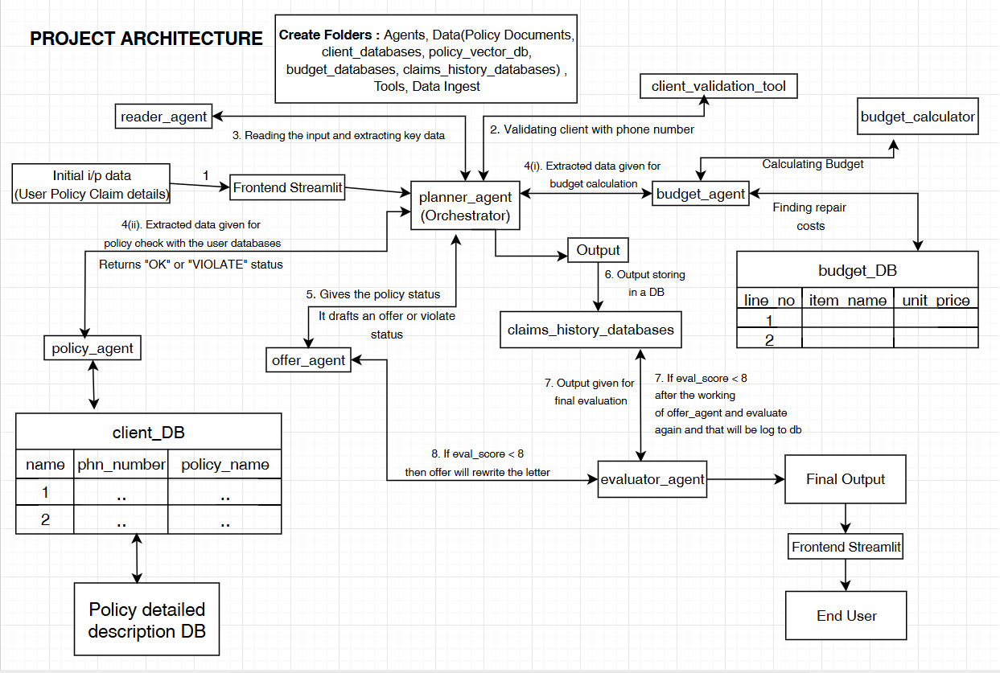

# 🛡️ Agentic Insurance Claims Pipeline

An autonomous, multi-agent AI architecture designed to process, evaluate, and resolve emergency property insurance claims. Built with **LangGraph**, this system acts as a digital settlement team, moving a claim from initial customer intake to final letter generation without human intervention.



## 🚀 Key Enterprise Features

* **Multi-Agent Orchestration:** Utilizes a state-graph architecture to route tasks between specialized agents (Planner, Reader, Policy, Budget, and Offer).
* **Parallel Processing:** Calculates structural repair budgets via local SQL databases while simultaneously retrieving complex policy conditions via Vector/RAG databases.
* **Agentic Reflexion (System 2 Thinking):** Features an autonomous Quality Assurance loop using **DeepEval**. The system grades its own drafted letters for faithfulness and relevancy, forcing rewrites if the output hallucinates or ignores the customer's core problem.
* **Fault Tolerance:** Implements exponential backoff and graceful degradation to handle API rate limits and cloud server outages (e.g., `503 UNAVAILABLE`) without crashing the application.
* **Audit Logging:** Saves comprehensive telemetry—including extracted variables, reasoning contexts, and final budgets—to a local SQLite database for historical tracking.
* **Decoupled Frontend:** Features a clean, intuitive Streamlit user interface that hides complex backend logic from the end-user.

## 🛠️ Tech Stack

* **Orchestration:** LangGraph, LangChain
* **LLM Engine:** Google Gemini (2.5 Flash)
* **Evaluation Framework:** DeepEval (LLM-as-a-Judge)
* **Databases:** ChromaDB (Vector/RAG), SQLite (Relational)
* **Frontend:** Streamlit
* **Language:** Python 3.x

## 📂 Project Structure

* `/Agents` - Contains the core LangGraph nodes (`planner_agent.py`, `policy_agent.py`, `evaluator_agent.py`, etc.) and the master state routing logic.
* `/Data` - Holds the local SQLite and ChromaDB instances for budgets, client registries, and policy manuals.
* `/Data_Ingest` - Scripts for embedding documents and logging final claims.
* `/Tools` - Pure mathematical and SQL-based tool calling functions (e.g., zero-latency budget calculators).
* `app.py` - The Streamlit frontend application.

## ⚙️ Local Setup & Installation

1. **Clone the repository:**
   ```bash
   git clone [https://github.com/YOUR-USERNAME/Agentic-Insurance-Claims-Pipeline.git](https://github.com/YOUR-USERNAME/Agentic-Insurance-Claims-Pipeline.git)
   cd Agentic-Insurance-Claims-Pipeline

2. Create and activate a virtual environment:
   # For Windows:
   python -m venv env
   .\env\Scripts\activate

   # For Mac/Linux:
   python3 -m venv env
   source env/bin/activate
   
3. Install dependencies:
   pip install langgraph deepeval streamlit google-genai python-dotenv pandas chromadb

4. Set up Environment Variables:
   Create a .env file in the root directory and add your Google Gemini API key:
   GOOGLE_API_KEY="your_api_key_here"

5. Launch the Application:
   streamlit run app.py
